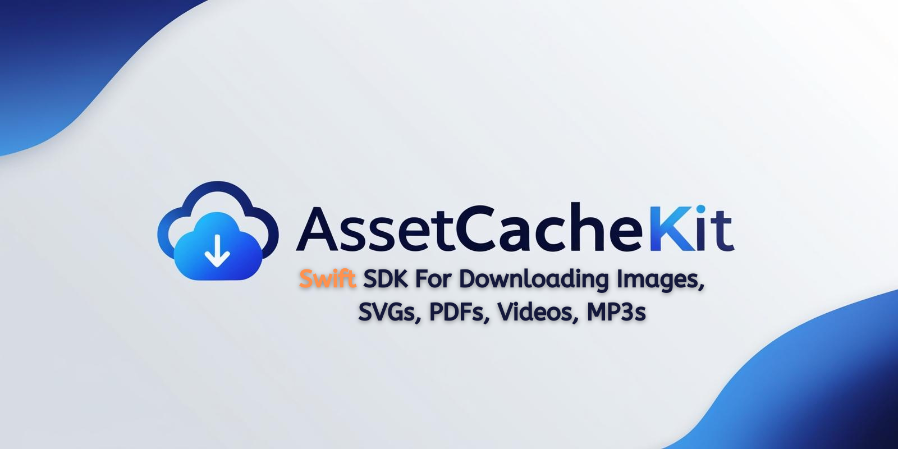

# AssetCacheKit



[](https://img.shields.io/badge/Swift-6.0-orange?style=flat-square)
[](https://img.shields.io/badge/Platforms-iOS_15.0-yellow?style=flat-square)
[](https://img.shields.io/badge/Platforms-macOS_12.0-green?style=flat-square)
[](https://img.shields.io/badge/Platforms-tvOS_15.0-khaki?style=flat-square)
[](https://img.shields.io/badge/Platforms-watchOS_8.0-red?style=flat-square)
[](https://img.shields.io/badge/Swift_Package_Manager-compatible-orange?style=flat-square)

**A Swift package that provides a generic and efficient way to asynchronously load and cache assets in SwiftUI applications.**

---

## Overview

`AssetCacheKit` is a powerful and flexible Swift package that provides an elegant solution for asynchronous asset loading and caching in SwiftUI applications. It offers a clean, protocol-oriented approach to handle various types of assets — images, PDFs, SVGs, and more — with a two-layer caching system, request deduplication, LRU eviction, and configurable retry logic built in.

---

## Features

- 🚀 **Asynchronous asset loading** with seamless SwiftUI integration
- 💾 **Two-layer cache** — in-memory NSCache for raw compressed bytes + persistent disk cache with expiration and LRU eviction
- 🖼️ **Decoded image cache** — stores already-decompressed `UIImage`/`NSImage` objects to eliminate repeated decoding on scroll
- 🔁 **Request deduplication** — concurrent requests for the same URL share a single in-flight task; the network is queried at most once
- ⚙️ **Configurable caching** — tune memory limits, disk quota, expiration, and retry policy per cache instance
- 🔄 **Automatic retry** with exponential back-off on transient network failures
- 🎨 **Customizable placeholder views** during loading
- ⚠️ **Strongly-typed error handling** via `AppError`
- 📐 **Downsampling support** for images — decode only the pixels that fit on screen using ImageIO
- 📱 **Multi-platform** — iOS 15+, macOS 12+, tvOS 15+, watchOS 8+
- 🧩 **Protocol-oriented design** — implement `AssetLoader` or `AssetRepository` to load any asset type from any source
- 🧪 **Fully tested** — comprehensive unit and UI test suite covering all caching layers, loaders, and error paths

---

## Requirements

| Platform | Minimum Version |
|----------|----------------|
| iOS      | 15.0+          |
| macOS    | 12.0+          |
| tvOS     | 15.0+          |
| watchOS  | 8.0+           |
| Swift    | 6.0+           |

---

## Installation

### Swift Package Manager

**Via Xcode:**

1. File → Add Packages…
2. Enter the package URL: `https://github.com/Mohsenkhodadadzadeh/AssetCacheKit`
3. Select the version you want to use

**Via `Package.swift`:**

```swift
dependencies: [
    .package(url: "https://github.com/Mohsenkhodadadzadeh/AssetCacheKit", from: "2.0.0")
]
```

---

## Usage

### Loading Images

```swift
import AssetCacheKit
import SwiftUI

struct ContentView: View {
    var body: some View {
        AssetCacheKit(
            loader: CachedImageLoader(url: URL(string: "https://example.com/photo.jpg"))
        ) { image in
            image
                .resizable()
                .scaledToFill()
        } placeholder: {
            ProgressView()
        } error: { error in
            Text(error.localizedDescription)
        }
    }
}
```

---

### Loading PDFs

```swift
import AssetCacheKit
import SwiftUI

struct PDFView: View {
    @State private var totalPages: Int? = nil
    @State private var currentPage: Int? = nil

    var body: some View {
        AssetCacheKit(
            loader: CachedPDFLoader(url: URL(string: "https://example.com/document.pdf"))
        ) { pdf in
            pdf
                .autoScale(true)
                .displayMode(.twoUpContinuous)
                .displayDirection(.vertical)
                .totalPage($totalPages)
                .currentPage($currentPage)
        } placeholder: {
            ProgressView()
        } error: { error in
            Text(error.localizedDescription)
        }

        if let total = totalPages, let current = currentPage {
            Text("Page \(current) of \(total)")
        }
    }
}
```

**PDF view modifiers:**

| Modifier | Description |
|---|---|
| `.autoScale(_:)` | Automatically scales the PDF to fit the view |
| `.displayMode(_:)` | `.singlePage`, `.singlePageContinuous`, `.twoUp`, `.twoUpContinuous` |
| `.displayDirection(_:)` | `.horizontal` or `.vertical` scrolling |
| `.totalPage(_:)` | Binding updated with total page count once the document loads |
| `.currentPage(_:)` | Binding updated as the user navigates pages |

---

### Loading SVGs

```swift
import AssetCacheKit
import SwiftUI

struct SVGView: View {
    var body: some View {
        AssetCacheKit(
            loader: CachedSVGLoader(url: URL(string: "https://example.com/icon.svg"))
        ) { image in
            image
                .resizable()
                .frame(width: 200, height: 200)
        } placeholder: {
            ProgressView()
        } error: { error in
            Text(error.localizedDescription)
        }
    }
}
```

> **Note:** SVG rendering uses Apple's private CoreSVG framework. This works correctly in apps distributed outside the App Store and in simulator builds, but may be rejected by App Store review. A public-API SVG renderer is planned for a future release.

---

## Cache Configuration

The shared `AssetCache` is used by all built-in loaders by default. You can create an independent cache instance with custom limits for specific use cases:

```swift
let thumbnailCache = AssetCache(configuration: AssetCacheConfiguration(
    rawDataMemoryByteLimit: 10 * 1_024 * 1_024,   // 10 MB in memory
    diskByteLimit:          100 * 1_024 * 1_024,   // 100 MB on disk
    defaultExpiration:      3 * 24 * 60 * 60,      // 3 days
    retryPolicy: RetryPolicy(maxAttempts: 5, initialDelay: 1.0, multiplier: 2.0)
))
```

**Default values for `AssetCache.shared`:**

| Property | Default |
|---|---|
| `rawDataMemoryByteLimit` | 80 MB |
| `diskByteLimit` | 512 MB |
| `defaultExpiration` | 365 days |
| `retryPolicy` | 3 attempts, 0.5 s initial delay, 2× back-off |

### Clearing the Cache

```swift
// Clear only the in-memory layer (disk entries are preserved)
await AssetCache.shared.clearMemory()

// Clear both memory and disk
await AssetCache.shared.clearAll()
```

### Prefetching

Warm the cache ahead of time so assets are ready before they appear on screen:

```swift
AssetCache.shared.prefetch(urls: [url1, url2, url3])
```

---

## Custom Asset Loaders

Create your own asset loader by conforming to the `AssetLoader` protocol:

```swift
struct AudioLoader: AssetLoader {
    var url: URL?
    
    func loadAsset() async throws -> YourAssetType {
        // Implement your custom loading logic here
    }
}
```

Then use it exactly like the built-in loaders:

```swift
AssetCacheKit(loader: AudioLoader(url: url)) { audioFile in
    AudioPlayerView(file: audioFile)
} placeholder: {
    ProgressView()
} error: { error in
    Text(error.localizedDescription)
}
```

---

## Custom Asset Repositories

Provide a custom `AssetRepository` to load assets from a non-standard source — a local bundle, an encrypted store, or a mock for testing:

```swift
struct BundleAssetRepository: AssetRepository {
    func loadAsset(with url: URL?) async throws -> Data {
        guard let url,
              let name = url.pathComponents.last,
              let fileURL = Bundle.main.url(forResource: name, withExtension: nil)
        else { throw AppError.assetLoading(.invalidURL) }
        return try Data(contentsOf: fileURL)
    }
}

// Inject into any built-in loader via the internal initialiser
let loader = CachedPDFLoader(
    url: url,
    loadAssetUseCase: DefaultLoadAssetUseCase(repository: BundleAssetRepository())
)
```

---

## Error Handling

All errors are reported as `AppError`, a strongly-typed enum with two cases:

```swift
public enum AppError: Error, Equatable {
    case assetLoading(AssetLoadingError)
    case network(NetworkError)
}
```

**Asset loading errors:**

| Case | Meaning |
|---|---|
| `.invalidURL` | The URL was nil or malformed |
| `.invalidImageData` | Bytes could not be decoded as an image |
| `.invalidPDFData` | Bytes could not be parsed as a PDF |
| `.invalidSVGData` | Bytes could not be rendered as SVG |
| `.invalidResponse` | Server returned a non-2xx response |

**Network errors** include `.noConnection`, `.timeout`, `.cannotFindHost`, `.badServerResponse(statusCode:)`, and more — see `NetworkError` in the source for the full list.

---

## Architecture

AssetCacheKit follows a clean, layered architecture:

```
┌─────────────────────────────────────────┐
│  Presentation                           │
│  AssetCacheKit (SwiftUI view)           │
│  AsyncPhase<Asset>                      │
└────────────────┬────────────────────────┘
                 │
┌────────────────▼────────────────────────┐
│  Domain                                 │
│  AssetLoader protocol                   │
│  LoadAssetUseCase protocol              │
│  CachedImageLoader / CachedPDFLoader    │
│  CachedSVGLoader                        │
└────────────────┬────────────────────────┘
                 │
┌────────────────▼────────────────────────┐
│  Data                                   │
│  AssetRepository protocol               │
│  DefaultAssetRepository                 │
│  AssetCache (memory + disk)             │
│  DecodedImageCache                      │
│  DiskCache                              │
│  NetworkFetcher                         │
└─────────────────────────────────────────┘
```

### Cache Layer Detail

```
Request
   │
   ▼
DecodedImageCache          ← decoded PlatformImage (images only)
   │ miss
   ▼
AssetCache (NSCache)       ← compressed raw bytes, in memory
   │ miss
   ▼
DiskCache                  ← compressed raw bytes, on disk
   │ miss                     LRU eviction + per-entry expiration
   ▼
NetworkFetcher             ← URLSession with exponential back-off retry
   │
   └──► writes to DiskCache + NSCache before returning
```

**Request deduplication:** concurrent requests for the same URL attach to a single in-flight `Task`; the network is queried at most once per URL regardless of how many callers are waiting.

---

## Best Practices

**Use `targetSize` for thumbnails.** Passing a `targetSize` to `CachedImageLoader` uses ImageIO to decode only the pixels that fit on screen, reducing peak memory by up to 99% for large source images.

**Prefetch visible URLs.** Call `AssetCache.shared.prefetch(urls:)` when you know which assets will appear next — for example, in `onAppear` of the cell just before the edge of a scroll view.

**Tune limits per use case.** The shared cache is sized for general use. A secondary cache for low-priority background assets can use a smaller `rawDataMemoryByteLimit` to avoid competing with foreground assets under memory pressure.

**Clear on logout.** Call `await AssetCache.shared.clearAll()` when a user logs out to prevent their cached assets from being served to the next user on a shared device.

---

## Contribution

Contributions are welcome. Please open an issue before submitting a pull request for significant changes. All pull requests should include tests covering the new or changed behaviour.

---

## License

AssetCacheKit is available under the MIT license. See the [LICENSE](LICENSE) file for details.
